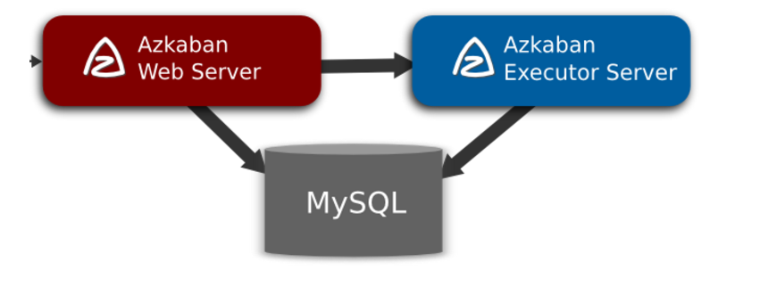
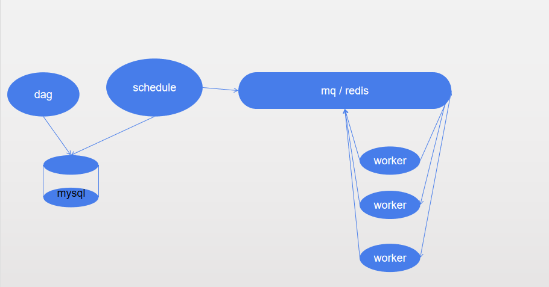
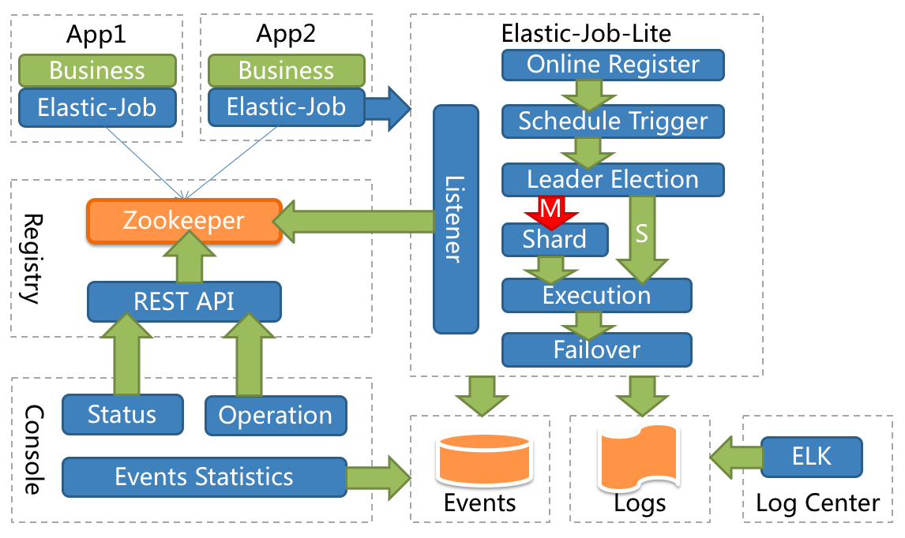

# 分布式调度调研

## 背景：

#### 现阶段我们部署的定时任务越来越多，使得管理变得很繁琐麻烦，而且之前用的Quartz所做的分布式功能只有实现高可用，没有做到任务的分布式执行，所以我们希望寻找一个分布式调度框架来解决这些问题

## 调研目的

#### 通过这次调研能够寻找一个适合我们使用调度框架
1. 框架能有一个良好的ui，尽可能的提供可视化操作，为我们的操作提供便利性
2. 尽量轻量级
3. 能够分布式的执行任务，减少调度任务服务器的压力
4. 社区比较活跃，有问题能够解决

## 调研思路

#### 通过初步的调研找了几种现在国内外常用以及比较活跃的分布式调度框架，如下：
* TBSchedule (TBSchedule是一款来自淘宝非常优秀的高性能分布式调度框架)
* azkaban (Azkaban是由Linkedin公司推出的一个批量工作流任务调度器，主要用于在一个工作流内以一个特定的顺序运行一组工作和流程)
* airflow (airflow 是一个编排、调度和监控workflow的平台，由Airbnb开源，现在在Apache Software Foundation 孵化)
* Oozie (Apache Oozie是工作流调度用在Hadoop中)
* elastic-job (elastic-job是当当开源的一款非常好用的作业框架)

#### 根据我们的目的进行初步的筛选，我选择了三种进行调研，分别是azkaban，airflow，elastic-job，主要从功能来进行对比


| | airflow | azkaban | elastic-job |
| ----- | ------ | ------ | ------ |
| 目的 | 通用批处理 | hadoop作业调度 | 提供分布式任务的协调服务 |
| 社区 | 很活跃(国内社区没那么活跃) | 活跃 | 活跃 |
| web界面 | 提供功能较丰富 | 提供功能不错 | 提供功能较差 |
| 编程语言 | python | Java | Java |
| HA | 支持 | 支持 | 支持 |
| Cron Job | 支持 | 支持 | 支持 |
| 监控 | 较好 | 有 | 有 |
| 单节点 | 支持 | 支持 | 支持 | 
| 使用 | 需要编写一定的python代码 | 简单 | 需要自己处理分片 |
| 分布式 | 支持 | 支持 | 支持 |


#### 接下来分别介绍着三个框架
### azkaban：
阿兹卡班是一个分布式工作流管理器，在LinkedIn上实现，以解决Hadoop工作依赖问题。我们的工作需要有序地运行，从ETL工作到数据分析产品。

架构:



原理：
* Azkaban WebServer需要根据Executor Server的运行状态信息，选择一个合适的Executor Server来运行WorkFlow，然后会将提交到队列中的WorkFlow调度到选定的Executor Server上运行。
* 从调度层面来看，Azkaban WebServer与Executor Server之间的交互方式非常简单，是通过REST API的方式来进行交互，基本的模式是，Azkaban WebServer根据调度的需要，主动调用Executor Server暴露的REST API来获取相应的资源信息，比如Executor Server的状态信息、分配WorkFlow到指定Executor Server上运行

   可以自己设置过滤条件

http://ju.outofmemory.cn/entry/352718

https://blog.csdn.net/daiyutage/article/details/69675633

核心概念 azkaban主要分为三个部分：
* WebServer:项目管理,权限授权,任务调度,监控executor,上传任务。
* ExecuteServer:用于执行任务。
* 存储元数据，如项目名称、项目描述、项目权限、任务状态、SLA规则等。

功能：
* Web用户界面
* 方便上传工作流
* 方便设置任务之间的关系
* 调度工作流
* 认证/授权(权限的工作)
* 能够杀死并重新启动工作流
* 模块化和可插拔的插件机制
* 项目工作区
* 工作流和任务的日志记录和审计

操作：

编写任务流(例)
可以执行的任务脚本有：shell，python，java，Linux命令等

hello.job
```
#hello.job
type=command
command=echo "create"
```
dependencehello.job
```
#dependencehello
type=command
command=echo "dependencehello"
dependencies=hello
```

将任务流打包上传到webserver


运行任务可以设置任务执行时间 cron表达式

-----

### airflow：
Airflow 是 Airbnb 开源的一个用 Python 编写的调度工具。于 2014 年启动，2015 年春季开源，2016 年加入 Apache 软件基金会的孵化计划。
Airflow 通过 DAG 也即是有向非循环图来定义整个工作流，因而具有非常强大的表达能力。

架构：


原理：
1. airflow启动时，会将dag中的相关信息写入数据库。 
2. scheduler会按照指定频次查询数据库，检测是否有需要触发的任务。 
3. 当scheduler检测到需要触发的任务时，会向消息队列发送一条Message。 
4. Celery会定时查询消息队列中，是否有Message。当检测到Message时，会将Message中包含的任务信息下发给Worker，由Worker执行具体任务。

核心概念：
* DAGs：即有向无环图(Directed Acyclic Graph)，将所有需要运行的tasks按照依赖关系组织起来，描述的是所有tasks执行的顺序。
* Operators：可以简单理解为一个class，描述了DAG中一个具体的task具体要做的事。其中，airflow内置了很多operators，如BashOperator 执行一个bash 命令，PythonOperator 调用任意的Python 函数，EmailOperator 用于发送邮件，HTTPOperator 用于发送HTTP请求， SqlOperator 用于执行SQL命令...同时，用户可以自定义Operator，这给用户提供了极大的便利性。
* Tasks：Task 是 Operator的一个实例，也就是DAGs中的一个node。
Task Instance：task的一次运行。task instance 有自己的状态，包括"running", "success", "failed", "skipped", "up for retry"等。
* Task Relationships：DAGs中的不同Tasks之间可以有依赖关系，如 TaskA >> TaskB，表明TaskB依赖于TaskA。

集群方式：
1. 启动多个webserver，通过HAProxy做LB。 
2. 启动多个Worker。 
3. 使用airflow-scheduler-failover-controller实现scheduler的高可用。 
4. Mysql做主从备份。 
5. RabbitMQ集群并配置Mirrored模式。

操作：
1. 编写任务流
2. 启动scheduler和worker

https://www.jianshu.com/p/e878bbc9ead2  
https://www.cnblogs.com/cord/p/9397584.html


----
### elastic-job:(去中心化)
Elastic-Job是一个分布式调度解决方案，由两个相互独立的子项目Elastic-Job-Lite和Elastic-Job-Cloud组成。
* elastic-job-lite定位为轻量级无中心化解决方案，使用jar包的形式提供分布
式任务的协调服务。
* elastic-job-cloud使用Mesos + Docker的解决方案，额外提供资源治理、应用分发以及进程隔离等服务。

因为elastic-job需要使用mesos+docker所以就研究了elastic-job-lite

功能特点：
* 分布式调度协调
* 弹性扩容缩容
* 失效转移
* 错过执行作业重触发
* 作业分片一致性，保证同一分片在分布式环境中仅一个执行实例
* 自诊断并修复分布式不稳定造成的问题
* 支持并行调度
* 支持作业生命周期操作
* 丰富的作业类型
* Spring整合以及命名空间提供
* 运维平台

架构：


elastic-job原理：
* 第一台服务器上线触发主服务器选举。主服务器一旦下线，则重新触发选举，选举过程中阻塞，只有主服务器选举完成，才会执行其他任务。
* 某作业服务器上线时会自动将服务器信息注册到注册中心，下线时会自动更新服务器状态。
* 主节点选举，服务器上下线，分片总数变更均更新重新分片标记。
* 定时任务触发时，如需重新分片，则通过主服务器分片，分片过程中阻塞，分片结束后才可执行任务。如分片过程中主服务器下线，则先选举主服务器，再分片。
* 通过上一项说明可知，为了维持作业运行时的稳定性，运行过程中只会标记分片状态，不会重新分片。分片仅可能发生在下次任务触发前。
* 每次分片都会按服务器IP排序，保证分片结果不会产生较大波动。
* 实现失效转移功能，在某台服务器执行完毕后主动抓取未分配的分片，并且在某台服务器下线后主动寻找可用的服务器执行任务。

核心概念：
* 分片概念
任务的分布式执行，需要将一个任务拆分为多个独立的任务项，然后由分布式的服务器分别执行某一个或几个分片项。
* 分片项与业务处理解耦 Elastic-Job并不直接提供数据处理的功能，框架只会将分片项分配至各个运行中的作业服务器，开发者需要自行处理分片项与真实数据的对应关系。

https://www.cnblogs.com/wyb628/p/7682580.html
https://www.cnblogs.com/acyouai/p/6702044.html
https://blog.csdn.net/jiequandao12/article/details/75575205

操作:

1.需要编写一个继承三种job中的一种的执行类,有如下三种类型的作业

* SimpleJob需要实现SimpleJob接口，意为简单实现，未经过任何封装，与quartz原生接口相似，比如示例代码中所使用的job。

* Dataflow类型用于处理数据流，需实现DataflowJob接口。该接口提供2个方法可供覆盖，分别用于抓取(fetchData)和处理(processData)数据。

* Script类型作业意为脚本类型作业，支持shell，python，perl等所有类型脚本

2.编写任务的执行情况，并将其注册到zk

3.执行任务


## 调研结论

通过这次调研，对于我们项目组的定时任务，大多是脚本类型，也有一些依赖，所以使用azkaban和airflow会更好，他们两所支持的web监控和对任务的操作也更加丰富，而在这之中，azkaban的使用又相对简单，所以自己觉得选取azkaban是个不错的选择
